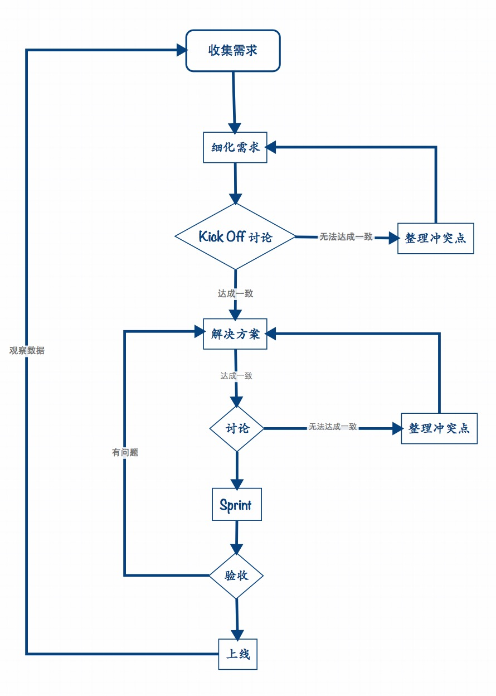

# **Done is better than perfect**

# **Move fast and break things**
# 目录

* [Scrum](#scrum)
   * [什么是 Scrum](#scrum_what_is_scrum) 
   * [基本概念](#scrum_base_info) 
   * [ How to do](#scrum_how_to_do) 
   
* [产品研发工作流程](#rd_work_flow)
   * [摘要](#rd_work_flow_summary) 
   * [整理需求](#rd_work_flow_get_require) 
   * [细化需求](#rd_work_flow_require_detail) 
   * [KickOff](#rd_work_flow_kickoff) 
   * [解决方案](#rd_work_flow_solutions) 
   * [Sprint](#rd_work_flow_sprint) 
   * [验收](#rd_work_flow_acceptance) 
   * [上线](#rd_work_flow_delpy) 
   * [检验数据](#rd_work_flow_validate) 

* [问题如何获得处理](#rd_work_flow)

<a name="scrum" id="scrum" /a>
## Scrum (由 @CarlChen 贡献)

----

<a name="scrum_what_is_scrum" id="scrum_what_is_scrum" /a>
### 什么是 Scrum

----
Scrum 在英语中是橄榄球运动中争球的意思。在软件领域中，Scrum 是一种敏捷软件开发的方法学，用于迭代式增量软件开发过程。虽然 Scrum 是为管理软件开发项目而开发的，它同样可以用于运行软件维护团队，或者作为计划管理方法。

<a name="scrum_base_info" id="scrum_base_info" /a>
### 基本概念

----
Scrum 是一个包括了一系列实践和预定义角色的过程骨架。 Scrum 中的主要角色包括：

1. **'Scrum Master'** 是 Scrum 教练和团队带头人，确保团队合理的运作 Scrum，并帮助团队移除实施中的障碍；
2. **产品负责人** （Product Owner）,确定产品的方向和愿景，定义产品发布的内容、优先级及交付实践，为产品*投资报酬率*（ROI）负责；
3. **开发团队**（Team），一个跨职能的小团队，人数5-9人，团队拥有交付可用软件所需要的各种技能。

<a name="scrum_how_to_do" id="scrum_how_to_do" /a>
### How to do

------
在每一次冲刺（一个15到30天的周期，其长度由开发团队决定）当中，开发团队创建可用的（可以随时推出）软件的一个增量。每一个冲刺所要实现的功能来自产品订单（product backlog）。产品订单是按照优先级排列的要完成的工作的概要的需求，哪些订单项会被加入一次冲刺将由冲刺计划会议决定。 在会议中，产品负责人告诉开发团队他需要完成产品订单中的哪些订单项。开发团队决定在下一次冲刺中他们能够承诺完成多少订单项。在冲刺的过程中，没有人能够变更冲刺订单（sprint backlog），这意味着在一个冲刺中需求是被冻结的。

在冲刺中，每一天都会举行项目状况会议，被“每日站立会议”。每日站立会议有一些具体的指导原则：

> * 会议准时开始。对于迟到者团队常常会制定惩罚措施（例如罚款，做俯卧撑等）
> * 欢迎所有人参加，但只有项目参与者可以发言。
> * 不论团队规模大小，会议被限制在15分钟。
> * 所有出席者都应站立。（有助于保持会议简短）
> * 会议应在固定地点和每天的同一时间举行。

在会议上，每个团队成员需要回答三个问题：

> 1. 你完成了那些工作？
> 2. 接下来你打算做什么？
> 3. 按时完成你的目标是否存在什么障碍？（Scrum主管需要记下这些障碍）

每一个冲刺完成后，都会举行一次冲刺回顾会议，在会议上所有团队成员都要反思这个冲刺。举行冲刺回顾会议是为了进行持续过程改进。会议的时间限制在4小时。

Scrum提倡所有团队成员坐在一起工作，进行口头交流，以及强调项目有关的规范（disciplines），这些有助于创造自我组织的团队。

Scrum的一个关键原则是承认客户可以在项目过程中改变主意，变更他们的需求，而预测式和计划式的方法并不能轻易地解决这种不可预见的需求变化。同样，Scrum采用了经验方法：承认问题无法完全理解或定义，而是关注于如何使得开发团队快速推出和响应不断出现的需求的能力最大化。

Scrum会议一共包含以下四种：
>  1） Sprint计划会议；
>  
> 2） 每日站立会议；
>  
> 3） 评审会议；
>  
> 4） 回顾会议

<a name="rd_work_flow" id="rd_work_flow"/a>
##产品研发工作流程

----
<a name="rd_work_flow_summary" id="rd_work_flow_summary" /a>
###摘要

先简明的概括下之后整个产品开发的流程.下面会有详细说明

> 1. 产品部门收集各种用户(外部,内部)需求,整理需求列表
> 2. 产品部门根据整理的需求列表,进行筛选,优先级排序,针对立项需求产出详细需求文档
> 3. 制定详细需求文档后,组织一次20分钟以内的会,细化里程碑,工时,各个时期需要的资源.
> 4. 产出更细致的文档: feature list, 里程碑,时间点安排,资源调度,产品图,交互图等
> 5. 针对 4 输出的结果进行讨论,进一步完善细化
> 6. 重复4,5直到产出团队都可以接受的文档
> 7. 根据里程碑时间点安排 sprint ,组成 sprint 小组, sprint 任务,时间安排等
> 8. 启动 sprint 周期,发 sprint 启动邮件通知所有相关人员.
> 9. 每日5分钟站会,同步进度等,具体 scrum 流程参考 scrum 说明
> 10. sprint 结束后评审会,验收里程碑或需求是否完成
> 11. 上线
> 12. 观察评估

 
---
<a name="rd_work_flow_get_require" id="rd_work_flow_get_require" /a>
### 整理需求
懒得写了...注意过滤需求,PD 的作用是做少而不做多,做多功能是个人都会,做少才是 PD 存在的意义.

这个阶段统一输出需求收集文档中并记录以下信息点

> 属性           | 说明 
> --------------|-------------- 
> id            |  需求编号,自增   
> 需求方         | 谁提出的需求,最终也要由其验收   
> 提出时间       | RT   
> 录入方         |  负责接收需求的 PD ,负责解释需求   
> 录入时间       | RT   
> 模块           |  功能涉及到得模块   
> 名称           | 简洁的描述需求 
> 描述           | 需求描述：无歧义、完整性、一致性、可测试等 
> 分类           | 新增功能,功能改进,体验优化,Bug修复,内部需求,运营需求,接口需求    
> 重要性         | 重要程度 1-5  5为最重要
> 紧急性         | 紧急程度 1-5  5最紧急
> 难度           | 开发难度 1-5  5为最难 基本为不可能完成任务  
> 商业价值       | 商业优先级 1-5  5为最高 单纯从商业角度,不考虑实现难度   
> 性价比         | 权衡 重要性,紧急性,难度,价值 后得出的数据 1-100   
> 状态           | 待讨论、暂缓、拒绝、需求整理中、开发中、已发布   
> 负责 PD        | 进入需求整理中时负责的 PD   
> 版本号         | 已发布的版本号   
> 备注         | 拒绝的理由等等
 
几个 link:

[如何做需求分析](http://www.zhihu.com/question/20407032)

[什么是「伪需求」](http://www.zhihu.com/question/19863805)

<a name="rd_work_flow_require_detail" id="rd_work_flow_require_detail" /a>
### 细化需求
<a name="rd_work_flow_kickoff" id="rd_work_flow_kickoff" /a>

### KickOff
Kickoff 会议应该控制在最长20分钟以内,为通气会.只讲解需求,不提出任何解决方案

参会人员: 需求方,PD,设计,技术,功能使用方,利益冲突方

> 出席人员推荐是相关部门 Leader 或者相关负责人

> 相关参会者必须参加,如果有事,必须指定一个人到场参加,会后由指定的人负责转述相关事宜.
> 并且认同指定的人做出的任何决定.

在这个会议内，需要传达的信息有如下几点。参会者进行讨论,提出意见.

> * 背景与意义
> * 目的与目标
> * 做法、功能点概述
> * 需要那些资源
> * 初步计划(必须清楚 1.时间点,里程碑  2.各个时间需要的资源)

<a name="rd_work_flow_solutions" id="rd_work_flow_solutions" /a>
### 解决方案
<a name="rd_work_flow_sprint" id="rd_work_flow_sprint" /a>
### Sprint
<a name="rd_work_flow_acceptance" id="rd_work_flow_acceptance" /a>
### 验收
<a name="rd_work_flow_delpy" id="rd_work_flow_delpy" /a>
### 上线
<a name="rd_work_flow_validate" id="rd_work_flow_validate" /a>
### 检验数据

