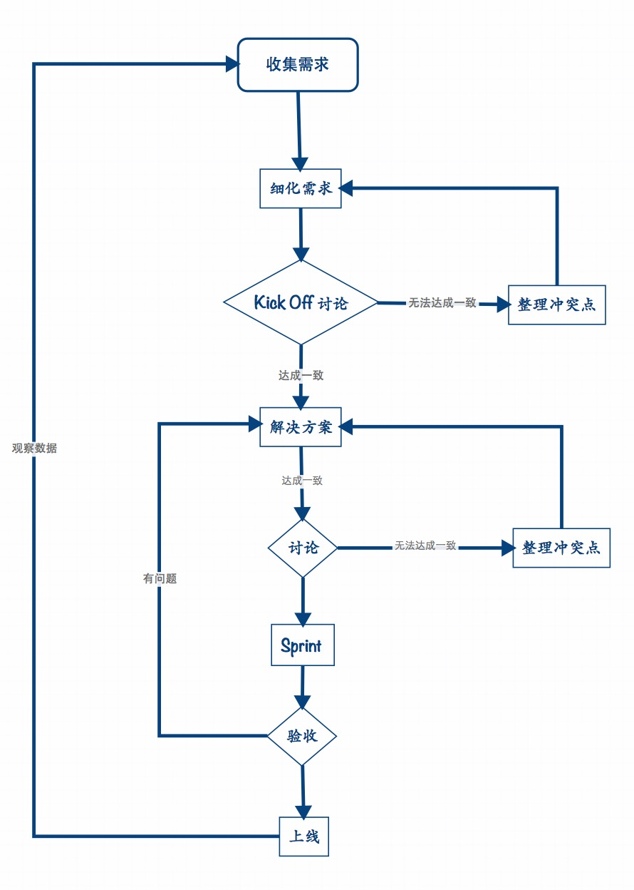

###摘要

先简明的概括下之后整个产品开发的流程.下面会有详细说明

> 1. 产品部门收集各种用户(外部,内部)需求,整理需求列表
> 2. 产品部门根据整理的需求列表,进行筛选,优先级排序,针对立项需求产出详细需求文档
> 3. 制定详细需求文档后,组织一次20分钟以内的会,细化里程碑,工时,各个时期需要的资源.
> 4. 产出更细致的文档: feature list, 里程碑,时间点安排,资源调度,产品图,交互图等
> 5. 针对 4 输出的结果进行讨论,进一步完善细化
> 6. 重复4,5直到产出团队都可以接受的文档
> 7. 根据里程碑时间点安排 sprint ,组成 sprint 小组, sprint 任务,时间安排等
> 8. 启动 sprint 周期,发 sprint 启动邮件通知所有相关人员.
> 9. 每日5分钟站会,同步进度等,具体 scrum 流程参考 scrum 说明
> 10. sprint 结束后评审会,验收里程碑或需求是否完成
> 11. 上线
> 12. 观察评估

 
---

